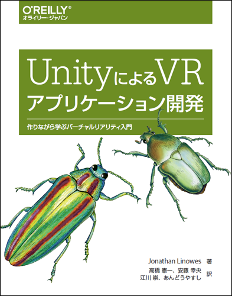

# UnityによるVRアプリケーション開発

---



---

本リポジトリはオライリー・ジャパン発行書籍『[UnityによるVRアプリケーション開発](http://www.oreilly.co.jp/books/9784873117577/)』（原書名『[Unity Virtual Reality Projects](https://www.packtpub.com/game-development/unity-virtual-reality-projects)』）のサポートサイトです。

## 日本語版巻末付録記事の全文を公開しました
* [付録A Gear VR 用のビルドとタッチパッドからの入力](https://github.com/oreilly-japan/unity-virtual-reality-projects-ja/wiki/%E4%BB%98%E9%8C%B2A)
* [付録B Daydreamコントローラーを使ってみる](https://github.com/oreilly-japan/unity-virtual-reality-projects-ja/wiki/%E4%BB%98%E9%8C%B2B)
    * Unity 5.6での対応方法など、本書発売当時から更新のあった情報も追記してあります

## Google VR SDK for Unity v1.50について
Unityの5.6より前のバージョンはサポート対象外となりました。（CardboardおよびDaydreamにネイティブ対応しているUnityのみが対象です。）

`GvrViewerMain`が無くなり、その代わりに`GvrEditorEmulator`が追加されました。この`GvrEditorEmulator`はUnityのエディターでプレビューする際にのみ必要なものです。
これらの変更に伴い、第1刷、第2刷ともに本文に下記の訂正があります。
* P.51 「3.4.4 プレハブの追加」において必要な手順は以下の一つのみとなります。プレハブの変更の適用も不要です。
  * Project パネルの Assets/GoogleVR/Prefabs フォルダーの中から`GvrEditorEmulator`を見つけて、［Hierarchy］パネルにドラッグします。
* P. 135 「Google CardboardもHMDの向きをリセットする同様の機能を持っています。もちろん位置のトラッキング機能はありません。GvrViewer.Recenter() を呼ぶことで向きとモーションセンサーだけがリセットされます。」という記述を削除
   * CardboardでもOculusと同様に`InputTracking.Recenter() `で再センタリング可能です。
* P.239 「10.4.2 Google Cardboard での利用」
   * 「FPSControllerに加えてGoogle VR SDKのプレハブ、GvrViewerMainを使用する必要があります。」を削除。
* P.240 
   * 「2. ProjectパネルのAssets/GoogleVR/PrefabsからGvrViewerMainを見つけて、現在のシーンにドラッグします。」を削除。
   * NetworkStart.csスクリプトの修正内容は[こちら](https://github.com/oreilly-japan/unity-virtual-reality-projects-ja/blob/master/code/chapter-10/Assets/Scripts/NetworkStart.cs)を参照ください。
   * 「このスクリプトでは、gvrMain の値を public な GameObject として定義します。Unity エ ディターにて、HierarchyパネルのNetworkControllerを選択した状態で、Inspectorの NetworkStart (Script) コンポーネントに Gvr Main の枠があるのを確認して、GvrViewerMain を Gvr Main にドラッグします。」を削除。
* P.241 「*1 訳注」の内容は下記の「ビルド設定の修正」と同様になります。
* P.253 「A.2.3 メインカメラの設定」の内容は不要となります。

このリポジトリにある各章のプロジェクトで使用していた`GvrViewerMain`は削除してあります。
Unityのエディターでプレビューをする際はGoogle VR SDK for Unityをダウンロード、インポートして`GvrEditorEmulator`を［Hierarchy］パネルに追加してください。
（もしGoogle VR SDK for Unity v1.40以前を使用する必要がある場合は[before_GVR1.50タグ](https://github.com/oreilly-japan/unity-virtual-reality-projects-ja/tree/before_GVR1.50)を参照してください）


## Unity 5.6でのCardboardおよびDaydream用の対応について
2017年3月31日にCardboardとDaydreamにネイティブ対応したUnity 5.6の正式版がリリースされました。それに伴い、本書で扱うプロジェクトのビルド設定とスクリプトに修正が必要な箇所があります。

### ビルド設定の修正
P.52の訳注にて「UnityもCardboardやDaydreamにネイティブ対応することを表明しているため、将来のバージョンではこのチェックを入れて、さらに［＋］ボタンを押して選択肢の中からGoogle VR、Cardboard、Daydream等の要素を選択して追加するという操作になることが想定されます。」と追記しておりましたが、その時が来たということになります。

以下はP.51の「3.4.5 ビルドの設定」をUnity 5.6以降用に修正したものです。変更点は［Virtual Reality Supported］のチェックボックスをONにすることです。（以前のバージョンではこのチェックボックスはOFFにしていましたが、UnityがCardboardとDaydreamにネイティブ対応したことにより、今後はこの設定が必要になります）

1. メインメニューの［File］→［Build  Settings...］を選択します。

2. ［Scenes In Build］に現在のシーンがない場合は、［Add Open Scenes］をクリックします。

3. 左側のPlatformの一覧から［Android］または［iOS］を選択して、［Switch Platform］をクリックします。

4. それから、［Player Settings...］をクリックします。InspectorパネルにPlayer Settingsが表示されます。

5. ［Other Settings］の中にある［Virtual Reality Supported］のチェックをONにします 。

6. [図1](#fig_b_2)のように［Virtual Reality Supported］チェックボックスの下に［Cardboard］もしくは［Daydream］の文字が表示されていることも確認します。もし表示されていなければ［＋］ボタンを押して選択肢の中から追加します。（iOSの場合は［Cardboard］のみが表示されます。）

7. ［Other Settings］→［Identification］→［Bundle Identifier］にcom.YourName.VRisAwesomeなどのように有効な文字列を入力します。

※ ［Resolution and Presentation］の中にある［Default Orientation］は、［Virtual Reality Supported］のチェックをONにすると自動設定されます。


<a name="fig_b_2">図1</a> Virtual Reality Supportedのチェックボックス

### スクリプトの修正
本書の複数箇所で使用している`Clicker.cs`というスクリプトを[Clicker.cs修正版](https://gist.github.com/ktaka/3d8a5b441e02a16a9b99ea1e18b8c1dd)のように修正する必要があります。（このリポジトリにあるものは修正済みです）
これは、現状のUnity 5.6 (5.6.0f3) とGoogle VR SDK for Unity 1.40の組合せでは、これまで使用していた`GvrViewer.Instance.Triggered`ではCardboardのトリガー操作を検知できず、Googleのサンプルでも`GvrViewer.Instance.Triggered`は使われていない様子のため、[GvrPointerInputModule.cs](https://github.com/googlevr/gvr-unity-sdk/blob/master/GoogleVR/Scripts/EventSystem/GvrPointerInputModule.cs) を参考に、Cardboardの場合に`GvrViewer.Instance.Triggered`を使わないよう、且つDaydreamでもOculus系（Rift, Gear VR）でも大丈夫なように修正したものです。

## サンプルコード

サンプルコードの解説は本書籍をご覧ください。

### ダウンロード方法
Unity 5.4.x 系以降のバージョンをお使いの場合は
<https://github.com/oreilly-japan/unity-virtual-reality-projects-ja/archive/master.zip>
から、

Unity 5.3.x 系をお使いの場合は
<https://github.com/oreilly-japan/unity-virtual-reality-projects-ja/archive/unity53x.zip>
から、それぞれダウンロードしてください。

### 使用方法
code フォルダーの下に本書のUnityプロジェクトを章ごとに完成した状態で用意してあります。ただし、Unity標準アセットやGoogle VR SDK等は含まれていないので、プロジェクトをUnityで開いたら次の手順で必要なものをインポートしてください。
（本書の手順に従って新規にプロジェクトを作成したい方は、`resources`フォルダーの下に各章ごとに必要なリソースファイルを置いてありますので、必要に応じてお使いください。）

1. メインメニューの［Assets］を選択します。それから［Import Package］→［Characters］の順に操作します。
2. インポート可能なすべてのものをリスト表示したインポートダイアログがポップアップするので［Import］をクリックします。
3. 同様にして［Assets］→［Import Package］→［Effects］の順に操作し、ポップアップしたインポートダイアログで［Import］をクリックします。
4. 同様にして［Assets］→［Import Package］→［ParticleSystems］の順に操作し、ポップアップしたインポートダイアログで［Import］をクリックします。
5. ウェブブラウザで<https://developers.google.com/vr/unity/download>を開いて、Google VR SDK for Unityをダウンロードします。
6. Unityのメインメニューの［Assets］から［Import Package］→［Custom Package...］を選択します。
7. ダウンロードした`GoogleVRForUnity.unitypackage`というファイルを見つけて選択します。
8. すべてのアセットにチェックが付いていることを確認して、［Import］をクリックします。
9. Projectパネルの`Assets`を選択し、シーン（Unityのロゴがアイコンになっているもの）をダブルクリックして開くとSceneビューにオブジェクトが表示されます。

[付録 A の GearVR 用のビルド設定はこちら](https://github.com/oreilly-japan/unity-virtual-reality-projects-ja/wiki/%E4%BB%98%E9%8C%B2A)

[付録 B の Daydream用アプリケーション開発環境の設定はこちら](https://github.com/oreilly-japan/unity-virtual-reality-projects-ja/wiki/%E4%BB%98%E9%8C%B2B)

## 実行環境

日本語版で検証に使用した各ソフトウェアのバージョン、およびハードウェアは次のとおりです。

#### ソフトウェア

* Unity 5.6.0f3, 5.5.0f3, 5.4.2f2-GVR12, 5.4.2f1, 5.3.6f1
* Blender 2.77
* Android SDK API level 23
* Xcode 8.3, 7.3.1
* Google VR SDK for Unity v1.40

#### ハードウェア（括弧内はOSのバージョン）

* Samsung Galaxy S6 edge（Android 6.0.1）
* Nexus 5X（Android 7.0）
* Moto Z (Android 7.0)
* iPhone 6 Plus（iOS 9.3.2）
* iPhone SE (iOS 10.3.1)
* MacBook Pro Retina, 13-inch, Mid 2014（Mac OS X 10.12.4）
* Windows PC, GPU: NVIDIA GeForce GTX980Ti（Windows 8）

#### VRデバイス

* Oculus Rift製品版、およびDK2
* Google Cardboard
* Sumsung Gear VR
* Daydream View

## 正誤表

下記の誤りがありました。お詫びして訂正いたします。

本ページに掲載されていない誤植・間違いを見つけた方は、japan＠oreilly.co.jpまでお知らせください。

### 第1刷をお持ちの方

#### 4章 P.65 20行目

_誤_

```
車アイコンを押して［Rest］を選択します。
```

_正_

```
車アイコンを押して［Reset］を選択します。
```

#### 5章 P.116 17行目

_誤_

```
DetectMoveDown()関数はUpdaet()が呼ばれるたびにカメラのX回転（角）を取得して
```

_正_

```
DetectMoveDown()関数はUpdate()が呼ばれるたびにカメラのX回転（角）を取得して
```

#### 7章 P.159 16行目

_誤_

```
_機能：_ レンガが空中からトランポリンに落ちてきて、上に跳ね返り、重力の影響により減衰する。
```

_正_

```
_機能：_ レンガが空中からトランポリンに落ちると上に跳ね返り、やがて重力の影響により落ちてくる。
```

#### 7章 P.161 5行目

_誤_

```
_機能：_ 一人称キャラクターがトランポリンに落ちてきて、上に跳ね返り、重力の影響により減衰する。
```

_正_

```
_機能：_ 一人称キャラクターがトランポリンに乗ると上に跳ね返り、やがて重力の影響により落ちてくる。
```
