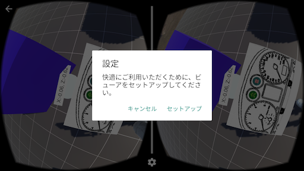
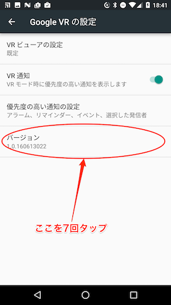
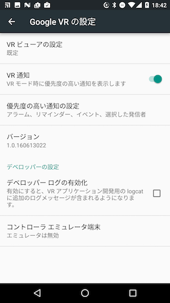

# Daydream用アプリケーション開発環境の設定

2016年8月26日の本書発売時点では、まだDaydream対応端末、ヘッドセット、およびコントローラーはまだ発売されていません。
現時点で付録Bで解説しているDaydream用サンプルプロジェクトを試すには次の2つの方法があります。

- コントローラー エミュレーター アプリをインストールしたAndroid端末をPCもしくはMacに接続して、UnityのPlayモードで実行します。 
- 2台のAndroid端末を用意して開発環境を設定します。それぞれヘッドセット用端末（VRアプリを動かして映像を表示する端末）とコントローラー用端末として設定する必要があります。ヘッドセットとしてはCardboardを使用することができます。

下記の設定手順は、[Set up a Daydream Development Kit](https://developers.google.com/vr/concepts/dev-kit-setup) にある説明に沿ったものです。

## コントローラー用端末の設定
コントローラー用端末はAndroid 4.4 (KitKat)以降のものがあれば大丈夫ですが、ジャイロスコープを搭載している必要があります。次のようにしてコントローラー エミュレーター アプリをインストールします。

1. [Google VR SDKのGitHub](https://github.com/googlevr/gvr-android-sdk/blob/master/apks/controller_emulator.apk?raw=true)からコントローラー エミュレーター アプリの apk ファイルをダウンロードします。controller_emulator.apk という名前のファイルがダウンロードされます。
2. 端末をUSBケーブルでPCもしくはMacに接続します。(Android アプリの開発環境は設定できているものとします）
3. キーボードからコマンドを入力して実行できる環境(ターミナル、コマンドプロンプト等)adb コマンドを使用してダウンロードした apk ファイルを端末にインストールします。
    ```
       adb install controller_emulator.apk
    ```
4. `Contoller Emulator` という名前でインストールされたコントローラー エミュレーター アプリを起動します。 


## UnityのPlayモードでの実行
### Unityでの設定
1. 本書の付録Bの手順に沿ってUnityで開発、若しくはappendix-BのプロジェクトをUnityでロードします。(Android アプリの開発環境は設定できているものとします）
2. Hierarchy パネルの `GvrControllerMain` を選択し、Inspector パネルの `Gvr Controller (Script)` コンポーネントの `Emulator Connection` で［USB］を選択します。（Android SDKに付属の `adb` コマンドにパスが通っている必要があります）
3. ［Play］ボタンを押してUnity上で実行します。コントローラー エミュレーター画面の上部の表示が緑色の "Connected (TCP/IP)" に変わります。

コントローラー エミュレーターのタッチパッドをタップしながら端末を傾けると赤いポインタが画面上で動いているはずです。


## 2台のAndroid端末での実行
### ヘッドセット用端末の設定
現時点ではNexus 6Pのみが開発用として唯一の対応端末となっており、Android 7.0 (Nougat)がインストールされていることが必要です。
（Android 7.0をインストールしたNexus 5Xでも動作させることは可能ですが非公式です。Nexus 6Pに比べると画面応答の性能は落ちます。）

1. 端末をUSBケーブルでPCもしくはMacに接続します。(Android アプリの開発環境は設定できているものとします）
2. Daydream用アプリケーションを端末にインストールします。本書の付録Bの手順に沿ってUnityで開発、若しくはappendix-BのプロジェクトをUnityでロードします。
3. ［Build Settings...］を開いて `Platform` が `Android` になっていなければ `Android` を選択して［Switch Platform］を押したあとに、［Build And Run］を実行します。
4. アプリが端末に転送されて実行されますがホームボタンを押して一旦終了し、端末の `設定` を開いて `アプリ` の設定に入ります。
5. 右上の縦に点が3つ並んでいるボタンを押して［システムを表示］を選択します。
6. リストの中から `Google VR サービス` を見つけてタップします。開いた画面で［権限］を押し、全ての権限を `ON` にします。
7. `設定`の`アプリ`の画面に戻り、右上にある歯車のアイコンを押して `アプリの設定` を開きます。
8. 画面の一番下にある［特別なアクセス］を押します。
9. `[通知を非表示]へのアクセス`、`VRヘルパーサービス`、`通知へのアクセス`の3つの項目をそれぞれ開いて、`Google VR サービス`を `ON` にします。
10. `設定`の`位置情報`を `ON` にして、モードを`高精度`に設定します。

#### Bluetoothのペアリング設定
2台の端末はBluetoothで通信します。

1. 両方の端末で設定のBluetoothを開き、`ON` にします。
2. ヘッドセット端末側で、デバイス一覧からコントローラー用端末の名前を見つけてタップします。
3. 両方の端末にペアリングを確認するダイアログが表示されるので承認します。

#### コントローラー用端末の指定
1. Daydream用アプリを起動します。
2. 画面中央の下の方にある歯車アイコンを押します。
3. ダイアログが表示されるので、`セットアップ`を押します。

    

4. Google VR の設定画面が表示されます。ここでバージョン表示の部分を7回タップしてデベロッパー用オプションを表示させます。

    

5. `デベロッパーの設定`が表示されるので、`コントローラー エミュレーター端末`を選択します。

    

6. リストから先ほどペアリングしたコントローラー用端末を選択します。
7. アプリを一旦終了します（最近起動したアプリの一覧から、このDaydream用アプリを横にスワイプして完全に終了させます）


### Daydreamアプリの起動
ヘッドセット用端末でDaydream用アプリを起動し、コントローラー用端末でコントローラー エミュレーター アプリを起動します。
両端末の接続が完了するとコントローラー エミュレーター アプリの上部の表示が緑色の "Connected" に変わります。ヘッドセット用端末をCardboard等のヘッドセットに装着し、コントローラー用端末はタッチパッドをタップしながら動かして操作してみましょう。

## うまく動作しない場合
以下の項目をチェックしてみてください。いずれかが当てはまる可能性があります。
- Unity の Play モードで実行する場合は adb コマンドにパスが通っていることを確認します。（ターミナルやコマンドプロンプトで、どのフォルダにいる状態でも adb と入力するだけで実行できる状態であればパスが通っています）
- Unity で Hierarchy パネルの `GvrControllerMain` を選択し、Inspector パネルの `Gvr Controller (Script)` コンポーネントの `Enable Gyro` のチェックボックスがONになっているか確認します。
- 端末を再起動します。幾つかの設定は再起動しないと有効にならない可能性があります。
